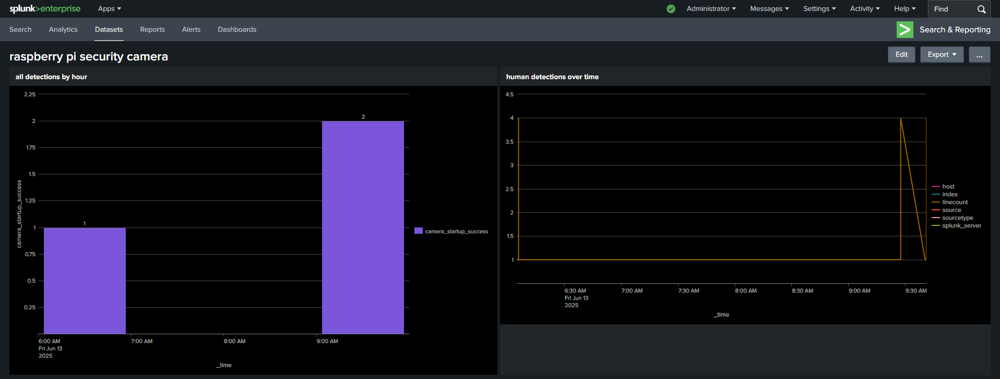

# Raspberry Pi SIEM Security Camera

## Description

A security monitoring system built from scratch on a Raspberry Pi. It transforms a webcam into a motion detector that captures images, serves them to a web interface, and forwards security events to a Splunk SIEM for live analysis and alerting.

---

### Showcase

### 1. SIEM Monitoring Dashboard
All security events from the Raspberry Pi are forwarded to a central Splunk instance. I created a custom dashboard to monitor these events in real-time, search through historical data, and visualize trends, simulating a professional Security Operations Center (SOC) workflow.

### 2. OS Hardening & Security
The Raspberry Pi OS was hardened to reduce its attack surface since this is an internet-facing and security-sensitive device. Key hardening steps included:
* Disabling password-based logins, instead using SSH key authentication.
* Configuring the UFW to only allow essential traffic.
* Deploying Fail2ban to automatically block IP addresses that fail too many login attempts.

*You can view the configuration files and commands used for this process here:* **[View Hardening Configs](configurations/)**

### 3. Motion detection & Web Interface
A Python script uses OpenCV to constantly monitor the webcam feed for motion. When motion is detected, a timestamped image is saved to a Flask web application that uses a simple UI to view all captured event images.

## Technologies Used

* **Hardware:** Raspberry Pi, USB Webcam
* **Operating System:** Raspberry Pi OS (Debian-based Linux)
* **Core Language:** Python
* **Libraries & Frameworks:** OpenCV, Flask
* **SIEM & Logging:** Splunk Enterprise, Splunk Universal Forwarder
* **System & Security Tools:** Git, GitHub, SSH, UFW Firewall, Fail2ban